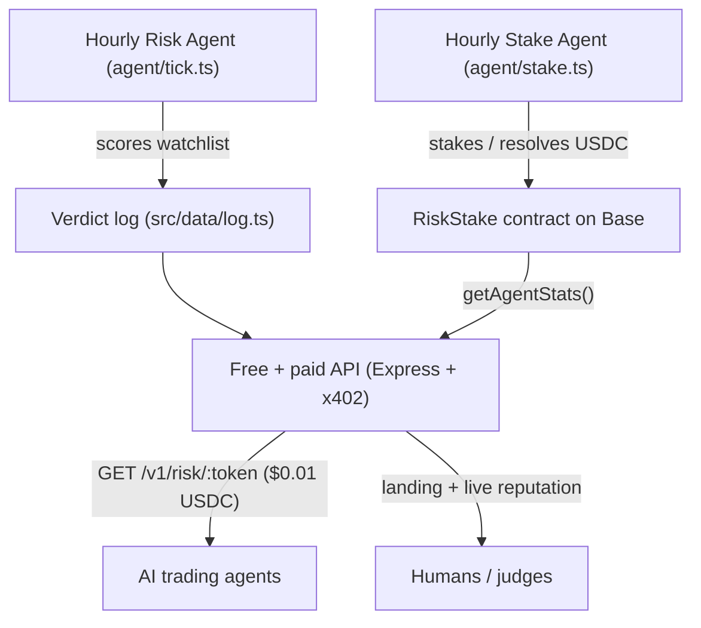

# Base Capital

**On-chain risk intelligence for Base — an autonomous agent that stakes real USDC behind every verdict, and a paid x402 API that AI trading agents can call before they swap.**

- 🌐 Live app: https://base-capital.vercel.app
- 🔗 RiskStake contract (verified): https://basescan.org/address/0x1E2806454d2a086120CCf09aA81a495d15e5Bd09#code
- 🏗 Built on Base mainnet · paid in USDC over [x402](https://www.x402.org) · attributed to Builder Code `bc_kob8hqa0`

---

## Why it's different

Most "risk score" APIs just *say* a token is safe. Base Capital's autonomous agent **puts money on it**: every verdict it publishes is also committed on-chain with a USDC stake in the `RiskStake` contract.

- A **correct** verdict → the stake is returned.
- A **wrong** verdict → the stake is **slashed to the treasury**.

The agent's entire track record — total staked, slashed, returned, and accuracy — is queryable on-chain by anyone, with **zero trust** in us. That is the moat: verifiable skin-in-the-game reputation for an AI agent.

---

## How it works



1. **Risk Agent** (`agent/tick.ts`, hourly) scores a watchlist of Base tokens 0–100 using free market + on-chain signals, and publishes a verdict log.
2. **Stake Agent** (`agent/stake.ts`, hourly) commits each fresh verdict on-chain with a $0.02 USDC stake, and resolves matured verdicts (return on correct, slash on wrong).
3. **API** serves the verdicts: free preview/feed/stats endpoints power the landing, paid x402 endpoints serve AI agents. Each paid call is a USDC transaction stamped with the Builder Code, counting toward Builder Rewards.
4. **On-chain reputation** is read live from the verified contract and surfaced on the landing page.

---

## On-chain layer — RiskStake

Minimal, audited-style staking contract (single file, no external deps). Verified on BaseScan.

| | |
|---|---|
| Contract | [`0x1E2806454d2a086120CCf09aA81a495d15e5Bd09`](https://basescan.org/address/0x1E2806454d2a086120CCf09aA81a495d15e5Bd09#code) |
| Network | Base mainnet (`eip155:8453`) |
| Stake asset | USDC `0x833589fCD6eDb6E08f4c7C32D4f71b54bdA02913` |
| Agent / oracle | `0x404d641eB58352c5AA23aF6b16d08f0C979f6778` |
| Stake per verdict | $0.02 USDC |

Key functions:

- `commitVerdict(id, token, rating, stake)` — agent stakes USDC behind a verdict (`rating`: 0 SAFE / 1 RISKY / 2 LIKELY_RUG).
- `resolveVerdict(id, correct)` — oracle resolves; correct returns the stake, wrong slashes it to the treasury.
- `getAgentStats(agent)` — public read: `totalVerdicts, totalStaked, totalSlashed, totalReturned, correct, wrong, accuracyBps`.

Protected by `onlyOwner` (resolve/admin) and a `nonReentrant` guard; `rescue()` exists purely as a hackathon safety valve so funds can never be locked.

---

## API

Base URL: `https://base-capital.vercel.app`

| Method & path | Price | Description |
|---|---|---|
| `GET /v1/risk/:token` | $0.01 USDC | Full risk score for a Base token (liquidity, LP, ownership, age, flags). x402-gated. |
| `GET /v1/signal/trending` | $0.01 USDC | Risk-ranked watchlist, riskiest first. Built for agent-to-agent use. x402-gated. |
| `GET /v1/preview/:token` | free (20/min/IP) | Same scoring as the paid route; powers the browser demo. |
| `GET /v1/feed?limit=` | free | Recent autonomous agent verdicts. |
| `GET /v1/stats` | free | Autonomous agent activity stats. |
| `GET /v1/onchain/stats` | free | Live RiskStake reputation (staked, slashed, accuracy). |
| `GET /` | free | Landing page (HTML), or JSON manifest via `Accept: application/json`. |
| `GET /manifest` | free | x402 manifest. |

Example — paid risk score response:

```json
{
  "token": "0x...",
  "score": 72,
  "rating": "medium",
  "flags": ["medium_liquidity", "owner_not_renounced"],
  "data": { "liquidityUsd": 38000, "volume24h": 91000, "ageHours": 53.2, "ownerRenounced": false },
  "disclaimer": "Heuristic score, not a buy/sell simulation.",
  "generatedAt": "2026-06-24T07:00:00.000Z"
}
```

The paid routes return `402 Payment Required` to an unpaid request. To call them, use an x402 client (e.g. `@x402/fetch`) with a funded wallet. Payments are gasless (EIP-3009): the keyless **xpay facilitator** (`facilitator.xpay.sh`) sponsors gas and settles USDC directly to the payout address.

---

## Builder Rewards attribution

Every paid call carries the Base Builder Code `bc_kob8hqa0` via the ERC-8021 attribution extension, so attributed USDC volume counts toward [Builder Rewards](https://www.base.dev). Payout resolves to the Basename **`artem00777.base.eth`**. The landing page embeds the Base App id (`6a3a6b5ad79487d5e6aaca0a`) meta tag for `base.dev` domain verification.

---

## Tech stack

- **Runtime:** Node 22+, TypeScript (ESM), Express
- **Payments:** `@x402/express`, `@x402/core`, `@x402/evm`, `@x402/extensions` (Builder Code)
- **Chain:** [viem](https://viem.sh) against Base mainnet; Foundry (`forge`) for the contract
- **Data:** DexScreener + GeckoTerminal (free tiers), on-chain reads via public RPC, 60s TTL cache
- **Hosting:** Vercel (serverless) — free tier
- **Automation:** GitHub Actions (hourly risk tick + hourly on-chain stake/resolve)

---

## Project layout

```
base-capital/
  contracts/
    RiskStake.sol        # on-chain staking + reputation (verified)
  agent/
    watchlist.ts         # tracked Base tokens
    tick.ts              # hourly risk scoring -> verdict log
    stake.ts             # hourly on-chain commit + resolve
  src/
    config.ts            # env, testnet/mainnet switch, addresses, builder code
    app.ts               # Express app + x402 gate + all routes
    server.ts            # local dev entry
    landing.ts           # HTML landing + live on-chain reputation block
    data/log.ts          # published verdict log (regenerated each tick)
    lib/
      dexscreener.ts     # free market data
      onchain.ts         # free RPC reads (owner, supply)
      risk.ts            # 0-100 scoring
      verdict.ts         # classify + deterministic verdict id (SHA-256)
      stake.ts           # viem client for RiskStake (read + write)
      cache.ts           # TTL cache
  api/index.ts           # Vercel serverless entry
  .github/workflows/
    agent.yml            # hourly risk tick
    stake.yml            # hourly on-chain stake/resolve
    deploy-contract.yml  # one-shot contract deploy (manual)
  foundry.toml
  vercel.json
```

---

## Run locally

```bash
npm install
cp .env.example .env      # defaults to testnet (Base Sepolia) — free, no keys
npm run dev               # http://localhost:3000

curl http://localhost:3000/manifest
curl http://localhost:3000/v1/preview/0x4200000000000000000000000000000000000006
```

Go to mainnet by setting `NETWORK_MODE=mainnet` (the contract address, USDC, RPC and xpay facilitator are all selected automatically in `config.ts`). No facilitator API keys required.

---

## Automation (GitHub Actions)

- **`agent.yml`** — runs `agent/tick.ts` every hour: re-scores the watchlist and commits the updated verdict log.
- **`stake.yml`** — runs `agent/stake.ts` every hour: commits fresh verdicts on-chain (budget-capped) and resolves matured ones. Needs the `DEPLOYER_PRIVATE_KEY` repo secret.
- **`deploy-contract.yml`** — manual `workflow_dispatch` to deploy `RiskStake` with Foundry.

All on-chain actions are bounded: max 3 commits and 3 resolves per run, $0.02 stake each.

---

## Honest limitations

- Risk scoring and honeypot heuristics are **not** a full buy/sell simulation — false negatives are possible.
- The public Base RPC can be flaky under load; on-chain reads may briefly lag a just-mined write.
- Builder Rewards require a Basename + Builder Score ≥ 40 + human verification + real attributed volume — not guaranteed income.

*Not financial advice.*

## 🔍 Discoverability & agent integrations

Base Capital ships a machine-readable x402 **discovery document** at [`/openapi.json`](https://base-capital.vercel.app/openapi.json) so AI agents and indexers can find, understand, and pay for the API automatically.

- **x402scan marketplace** — listed (2/2 resources) at <https://www.x402scan.com>
- **Poncho** — auto-generated agent merchant page at <https://tryponcho.com/m/base-capital.vercel.app>
- **Discovery doc** — `GET /openapi.json` declares the paid routes `/v1/risk/{token}` and `/v1/signal/trending` with `x-payment-info` ($0.01 USDC on Base mainnet), plus a free preview at `/v1/preview/{token}`.

Verified end-to-end: agents discover the endpoints via the discovery document, parse the capabilities, and call them — the free preview returns live GoPlus-backed risk data with no payment required.
