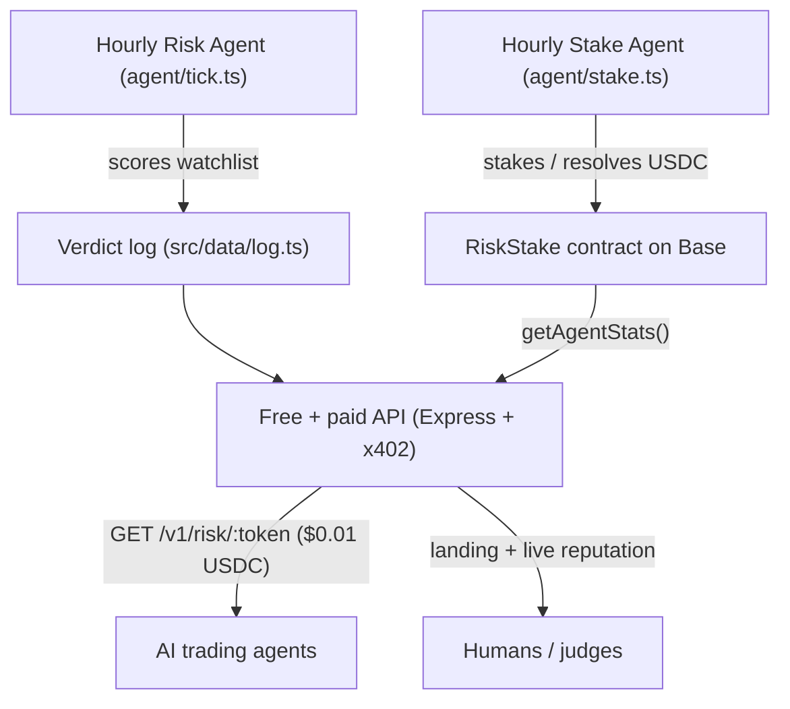

# Base Capital

> 🪪 **Agent identity (ERC-8004):** registered on Base mainnet — agentId `57556` in IdentityRegistry [`0x8004A169…a432`](https://basescan.org/address/0x8004A169FB4a3325136EB29fA0ceB6D2e539a432).
> Owner & agent wallet `0x404d641eB58352c5AA23aF6b16d08f0C979f6778` · on-chain `tokenURI` metadata · [register tx](https://basescan.org/tx/0xf27f29322becb6a27c2dcc144e01f4f9d5a0991506e9aadad85887f29b625bbf).


**On-chain risk intelligence for Base — an autonomous agent that stakes real USDC behind every verdict, and a paid x402 API that AI trading agents can call before they swap.**

- 🌐 Live app: https://base-capital.vercel.app
- 🔗 RiskStake v1.0 contract (verified) — see v3 below: https://basescan.org/address/0x21d49dE1f154FF49608acbc750926e6d7Db22cCB#code
- 🏗 Built on Base mainnet · paid in USDC over [x402](https://www.x402.org) · attributed to Builder Code `bc_kob8hqa0`

---

## Why it's different

Most "risk score" APIs just *say* a token is safe. Base Capital's autonomous agent **puts money on it**: every verdict it publishes is also committed on-chain with a USDC stake in the `RiskStake` contract.

- A **correct** verdict → the stake is returned.
- A **wrong** verdict → the stake is **slashed to the treasury**.

The agent's entire track record — total staked, slashed, returned, and accuracy — is queryable on-chain by anyone, with **zero trust** in us. That is the moat: verifiable skin-in-the-game reputation for an AI agent.

---

## How it works



1. **Risk Agent** (`agent/tick.ts`, hourly) scores a watchlist of Base tokens 0–100 using free market + on-chain signals, and publishes a verdict log.
2. **Stake Agent** (`agent/stake.ts`, hourly) commits each fresh verdict on-chain with a $1 USDC stake, and resolves matured verdicts (return on correct, slash on wrong).
3. **API** serves the verdicts: free preview/feed/stats endpoints power the landing, paid x402 endpoints serve AI agents. Each paid call is a USDC transaction stamped with the Builder Code, counting toward Builder Rewards.
4. **On-chain reputation** is read live from the verified contract and surfaced on the landing page.

---

## On-chain layer — RiskStake (v1.0)

Minimal, audited-style staking contract (single file, no external dependencies). Verified on BaseScan.

| | |
|---|---|
| Contract | [`0x21d49dE1f154FF49608acbc750926e6d7Db22cCB`](https://basescan.org/address/0x21d49dE1f154FF49608acbc750926e6d7Db22cCB) (v1.0 — legacy; superseded by v3 below) |
| Network | Base mainnet (`eip155:8453`) |
| Stake asset | USDC `0x833589fCD6eDb6E08f4c7C32D4f71b54bdA02913` |
| Roles | `owner` (admin) · `oracle` (resolves) · `treasury` (receives slashes) — three independent on-chain roles |
| Stake per verdict | configurable, default **$1** (bounds $1–$1000) |
| Rescue | **48-hour timelock** + events (no instant drain) |

Key functions:

- `commitVerdict(id, token, rating, stake)` — agent stakes USDC behind a verdict (`rating`: 0 SAFE / 1 RISKY / 2 LIKELY_RUG). Stake must be within `[minStake, maxStake]`.
- `resolveVerdict(id, correct, proofHash)` — **`onlyOracle`**, `nonReentrant`, maturity-guarded. Publishes the deterministic resolution proof hash on-chain. Correct → stake returned; wrong → slashed to treasury.
- `getAgentStats(agent)` — public read: `totalVerdicts, totalStaked, totalSlashed, totalReturned, correct, wrong, accuracyBps, totalAtRisk, slashRateBps`.
- `pendingCount()` / `getPending(offset, limit)` — enumerate unresolved verdicts.
- `queueRescue` / `executeRescue` / `cancelRescue` — timelocked admin recovery (48h); every step emits an event.

---

## On-chain layer v3 — optimistic resolution & agentId reputation (live)

> **v3 is the current deployment.** It supersedes the one-step `resolveVerdict` flow above with **optimistic resolution + a public challenge window**, binds reputation to the agent's **ERC-8004 agentId** (not a raw address, so the signing key can rotate without losing track record), and adds **independently reproducible proofs** (on-chain rule version + input-snapshot pointer). Roles, stake bounds and the 48h timelocked rescue are unchanged.

| | |
|---|---|
| Contract (v4, live) | [`0xBaa5175987951E6DAb9Ae52CB4fa8b1C64Ca3037`](https://basescan.org/address/0xBaa5175987951E6DAb9Ae52CB4fa8b1C64Ca3037) — **verified (Sourcify `exact_match`)**, agent commits decision inputs |
| Contract (v3) | [`0x0eC7de61eE08659743A896FeB15BfB99361f440e`](https://basescan.org/address/0x0eC7de61eE08659743A896FeB15BfB99361f440e) — **verified (Sourcify `exact_match`)** |
| Legacy (v2) | [`0x21d49dE1f154FF49608acbc750926e6d7Db22cCB`](https://basescan.org/address/0x21d49dE1f154FF49608acbc750926e6d7Db22cCB) — original track record, retained read-only |
| Agent identity | ERC-8004 agentId `57556` · signer `0x404d641eB58352c5AA23aF6b16d08f0C979f6778` |
| Network · stake asset | Base mainnet (`eip155:8453`) · USDC `0x833589fCD6eDb6E08f4c7C32D4f71b54bdA02913` |

**Optimistic resolution flow:**

1. `commitVerdict(id, token, rating, stake)` — the signer must be a **registered agentId** (`registerAgent` / `rotateAgentSigner`); reputation accrues to the agentId.
2. `proposeResolution(id, correct, proofHash, ruleVersion, snapshotURI)` — **`onlyOracle`**, maturity-guarded. Posts the outcome **optimistically** and opens a **1h challenge window**; `proofHash`, on-chain `ruleVersion`, and the `snapshotURI` input pointer are all stored on-chain.
3. `challengeResolution(id)` — **anyone** can dispute within the window by posting a USDC bond.
4. `finalize(id)` — after the window elapses unchallenged, anyone can settle: correct → stake returned; wrong → slashed to treasury.
5. `resolveChallenge(id, challengeSucceeded)` — **`onlyOwner`** arbitrates a dispute: a successful challenge flips the outcome, returns the bond, and pays the challenger `challengeRewardBps` (default **50%**) of the slashed stake; a failed challenge sends the bond to the treasury.

- `getAgentStats(agentId)` — public read keyed by agentId: `totalVerdicts, totalStaked, totalSlashed, totalReturned, correct, wrong, accuracyBps, totalAtRisk, slashRateBps, identityAgeSeconds`.
- `pendingCount()` / `getPending(offset, limit)` — **O(1)** pending index (swap-pop), so enumeration cost no longer grows with history.
- `setChallengeParams(window, bond, rewardBps)` — owner-tunable challenge economics.

Tests: Foundry suite **16/16 passing** (`forge test --via-ir`) — commit, register/rotate, propose/finalize, challenge/resolve (both outcomes), bond accounting, maturity & bound guards, and the O(1) pending invariants.

---

## Resolution policy

Verdicts are resolved by a **deterministic rule**, not human discretion — anyone can predict and verify the outcome. The rule below is the single source of truth for every resolution.

At maturity the token is re-assessed live and classified as a *hard rug* if any of these flags are present: `honeypot`, `sim_honeypot`, `sim_extreme_sell_tax`, `cannot_sell_all`, `cannot_buy`.

- **SAFE (0)** is correct ⟺ the token is **not** a hard rug **and** its score ≥ 75.
- **RISKY (1) / LIKELY_RUG (2)** is correct ⟺ the token **is** a hard rug **or** its score < 75.

The agent computes a `keccak256` **proof hash** over the resolution snapshot (token, score, flags, rule version) and then:

1. passes it to `proposeResolution(...)` (settled by `finalize` after the 1h challenge window) so it is stored **on-chain**, and
2. prints it to the public CI logs.

Anyone can recompute the hash from the published verdict plus this rule and confirm the resolution was not tampered with.

---

## Trust model

- **Separation of powers.** The contract enforces three independent roles — `owner` (config/admin), `oracle` (the *only* address allowed to resolve verdicts) and `treasury` (receives slashed stakes) — each of which can be a distinct key. In the current deployment `treasury` is a **separate** address from the operator, so slashed stakes leave the agent's control entirely (recoverable only via the public 48h timelock). `owner`/`oracle` are run by the operator; resolution is trustless not through key custody but through the **deterministic rule + on-chain proof hash**, which anyone can recompute. The contract is therefore ready for full key separation / decentralization without redeployment.
- **Bounded authority.** `resolveVerdict` is `onlyOracle`, `nonReentrant`, and cannot run before a verdict reaches `minMaturity`.
- **Real skin in the game.** Stakes are bounded and default to **$1** (vs the previous $1). `getAgentStats` exposes `totalAtRisk` and `slashRateBps`, so the agent's live exposure and historical loss rate are public.
- **No silent drain.** Admin fund recovery is **timelocked 48h** with events at queue / execute / cancel — token holders always get notice.

---

## Security

- **No unbounded `rescue()`.** The previous instant-withdraw escape hatch is replaced by a 48-hour **timelocked** rescue (`queueRescue` → wait → `executeRescue`), cancellable via `cancelRescue`, with an event at every step.
- **Reentrancy-guarded** state-changing calls (`nonReentrant`).
- **Maturity guard** prevents premature resolution.
- **Minimal surface:** single-file contract, no external dependencies, Solc 0.8.24, optimizer (200 runs).
- **Tests:** Foundry suite **17/17 passing** — commit/resolve/return/slash, role enforcement (`onlyOracle` / `onlyOwner`), maturity guard, stake-bound checks, and the full timelock lifecycle. Reproduce with `forge test -vv`.

---

## API

Base URL: `https://base-capital.vercel.app`

| Method & path | Price | Description |
|---|---|---|
| `GET /v1/risk/:token` | $0.01 USDC | Full risk score for a Base token (liquidity, LP, ownership, age, flags). x402-gated. |
| `GET /v1/signal/trending` | $0.01 USDC | Risk-ranked watchlist, riskiest first. Built for agent-to-agent use. x402-gated. |
| `POST /v1/risk/batch` | $0.01 USDC | Score up to 10 Base tokens in one call (body `{ tokens: string[] }`, 1-10). Per-token error isolation. x402-gated, Builder-Code attributed. |
| `GET /v1/preview/:token` | free (20/min/IP) | Same scoring as the paid route; powers the browser demo. |
| `GET /v1/feed?limit=` | free | Recent autonomous agent verdicts. |
| `GET /v1/stats` | free | Autonomous agent activity stats. |
| `GET /v1/onchain/stats` | free | Live RiskStake reputation (staked, slashed, accuracy). |
| `GET /` | free | Landing page (HTML), or JSON manifest via `Accept: application/json`. |
| `GET /manifest` | free | x402 manifest. |

Example — paid risk score response:

```json
{
  "token": "0x...",
  "score": 72,
  "rating": "medium",
  "flags": ["medium_liquidity", "owner_not_renounced"],
  "data": { "liquidityUsd": 38000, "volume24h": 91000, "ageHours": 53.2, "ownerRenounced": false },
  "disclaimer": "Heuristic score combining market data, on-chain reads, GoPlus and a live honeypot.is simulation.",
  "generatedAt": "2026-06-24T07:00:00.000Z"
}
```

The paid routes return `402 Payment Required` to an unpaid request. To call them, use an x402 client (e.g. `@x402/fetch`) with a funded wallet. Payments are gasless (EIP-3009): the keyless **xpay facilitator** (`facilitator.xpay.sh`) sponsors gas and settles USDC directly to the payout address.

---

## Builder Rewards attribution

Every paid call carries the Base Builder Code `bc_kob8hqa0` via the ERC-8021 attribution extension, so attributed USDC volume counts toward [Builder Rewards](https://www.base.dev). Payout resolves to the Basename **`artem00777.base.eth`**. The landing page embeds the Base App id (`6a3a6b5ad79487d5e6aaca0a`) meta tag for `base.dev` domain verification.

---

## Tech stack

- **Runtime:** Node 22+, TypeScript (ESM), Express
- **Payments:** `@x402/express`, `@x402/core`, `@x402/evm`, `@x402/extensions` (Builder Code)
- **Chain:** [viem](https://viem.sh) against Base mainnet; Foundry (`forge`) for the contract
- **Data:** DexScreener + GeckoTerminal (free tiers), on-chain reads via public RPC, 60s TTL cache
- **Hosting:** Vercel (serverless) — free tier
- **Automation:** GitHub Actions (hourly risk tick + hourly on-chain stake/resolve)

---

## Project layout

```
base-capital/
  contracts/
    RiskStake.sol        # on-chain staking + reputation (verified)
  agent/
    watchlist.ts         # tracked Base tokens
    tick.ts              # hourly risk scoring -> verdict log
    stake.ts             # hourly on-chain commit + resolve
  src/
    config.ts            # env, testnet/mainnet switch, addresses, builder code
    app.ts               # Express app + x402 gate + all routes
    server.ts            # local dev entry
    landing.ts           # HTML landing + live on-chain reputation block
    data/log.ts          # published verdict log (regenerated each tick)
    lib/
      dexscreener.ts     # free market data
      onchain.ts         # free RPC reads (owner, supply)
      risk.ts            # 0-100 scoring
      verdict.ts         # classify + deterministic verdict id (SHA-256)
      stake.ts           # viem client for RiskStake (read + write)
      cache.ts           # TTL cache
  api/index.ts           # Vercel serverless entry
  .github/workflows/
    agent.yml            # hourly risk tick
    stake.yml            # hourly on-chain stake/resolve
    deploy-contract.yml  # one-shot contract deploy (manual)
  foundry.toml
  vercel.json
```

---

## Run locally

```bash
npm install
cp .env.example .env      # defaults to testnet (Base Sepolia) — free, no keys
npm run dev               # http://localhost:3000

curl http://localhost:3000/manifest
curl http://localhost:3000/v1/preview/0x4200000000000000000000000000000000000006
```

Go to mainnet by setting `NETWORK_MODE=mainnet` (the contract address, USDC, RPC and xpay facilitator are all selected automatically in `config.ts`). No facilitator API keys required.

---

## Automation (GitHub Actions)

- **`agent.yml`** — runs `agent/tick.ts` every hour: re-scores the watchlist and commits the updated verdict log.
- **`stake.yml`** — runs `agent/stake.ts` every hour: commits fresh verdicts on-chain (budget-capped) and resolves matured ones. Needs the `DEPLOYER_PRIVATE_KEY` repo secret.
- **`deploy-contract.yml`** — manual `workflow_dispatch` to deploy `RiskStake` with Foundry.

All on-chain actions are bounded: max 1 commit and 3 resolves per run, $1 stake each.

---

## Backtest results

The risk engine is validated against an **independent** ground-truth oracle — [honeypot.is](https://honeypot.is) buy/sell **simulation** (chainID 8453), which forks chain state and simulates a real buy then sell. It is independent of our DexScreener / GoPlus / owner heuristics, so it is a fair judge.

**Universe (latest run):** 39 candidate Base tokens — blue-chip controls + watchlist + live GeckoTerminal discovery + a low-liquidity new-pool harvest + the agent's own published verdicts. All real on-chain addresses; **no hardcoded rug list**. 21 tokens were oracle-labelled (2 unsafe / 19 safe); 18 the oracle could not classify were **skipped, not guessed**.

**Headline — slashing-grade verdicts (`score < 40`, LIKELY_RUG):**

| Metric | Value |
|---|---|
| Precision | **1.00** |
| Recall | **1.00** |
| F1 | **1.00** |
| Accuracy | **1.00** |

Both live honeypots in the set (`Surplus`, `NOCK`) were caught, with **zero** false LIKELY_RUG verdicts — the agent never stakes a rug call on a token that is actually sellable.

**Ablation — does the live simulation matter? (threshold 75)**

| Engine | Precision | Recall |
|---|---|---|
| With live simulation | 0.40 | **1.00** |
| Static only (no simulation) | 0.00 | 0.00 |

Without the simulation the static engine catches **0 of 2** honeypots; with it, **2 of 2**. The simulation is what turns the agent from "never flags a rug" into a real risk-taker.

**Threshold sweep (with simulation):**

| Threshold | Precision | Recall | F1 | Accuracy |
|---|---|---|---|---|
| 40 | 1.00 | 1.00 | 1.00 | 1.00 |
| 45–60 | 0.67 | 1.00 | 0.80 | 0.95 |
| 65 | 0.50 | 1.00 | 0.67 | 0.91 |
| 70–80 | 0.40 | 1.00 | 0.57 | 0.86 |
| 85 | 0.29 | 1.00 | 0.44 | 0.76 |

> Precision at `score < 75` is a deliberate **lower bound**: the engine also down-scores legitimate-but-risky tokens (modifiable tax, sub-24h pools, low liquidity) that the honeypot oracle still counts as "safe". On the slashing-grade boundary that actually risks capital (`< 40`), precision is 1.00.

**Reproduce:** `NETWORK_MODE=mainnet npx tsx agent/backtest.ts` — results are also served live at `GET /backtest`.

---

## Honest limitations

- Risk scoring now runs a live buy/sell simulation (honeypot.is), but it cannot simulate tokens it does not index — those are flagged and skipped, not guessed — and a token that is sellable now can still rug later.
- The public Base RPC can be flaky under load; on-chain reads may briefly lag a just-mined write.
- Builder Rewards require a Basename + Builder Score ≥ 40 + human verification + real attributed volume — not guaranteed income.

*Not financial advice.*

## 🔍 Discoverability & agent integrations

Base Capital ships a machine-readable x402 **discovery document** at [`/openapi.json`](https://base-capital.vercel.app/openapi.json) so AI agents and indexers can find, understand, and pay for the API automatically.

- **x402scan marketplace** — listed (2/2 resources) at <https://www.x402scan.com>
- **Poncho** — auto-generated agent merchant page at <https://tryponcho.com/m/base-capital.vercel.app>
- **Discovery doc** — `GET /openapi.json` declares the paid routes `/v1/risk/{token}` and `/v1/signal/trending` with `x-payment-info` ($0.01 USDC on Base mainnet), plus a free preview at `/v1/preview/{token}`.

Verified end-to-end: agents discover the endpoints via the discovery document, parse the capabilities, and call them — the free preview returns live GoPlus-backed risk data with no payment required.

---

## 🏁 Milestones

### 2026-07-07 - Production hardening: CI, resilient sources, batch API
- **Farcaster launch + PNG preview** — published the @basecapital launch cast and fixed the embed card: Farcaster / Base App now render a real PNG (`/embed.png`, 3:2) instead of the unsupported SVG that showed a broken image. Profile: https://farcaster.xyz/basecapital
- **Farcaster auto-alerts** — the @basecapital agent auto-casts high-conviction rug alerts (score < 30) to Farcaster via Neynar after each hourly risk tick (per-token 48h cooldown, max 3/run), embedding the mini app as a frame for zero-cost distribution.
Three shipped upgrades, all backward-compatible and green in CI: (1) **Reliability & CI** - a dedicated `contracts` job runs `forge test` alongside the TypeScript `test` job on every push, and a new `GET /healthz` probes the Base RPC and contract wiring. (2) **Source resilience** - a shared `fetchJson` helper adds request timeouts, retries with exponential backoff + jitter, and a per-host circuit breaker across DexScreener/GoPlus/honeypot.is; DexScreener now degrades gracefully instead of 500-ing the endpoint, and every risk response now carries a `confidence` (0-1) score plus per-source `sources[]` health (verified live: WETH 96/confidence 1.0, all four sources ok). (3) **Batch API** - a new paid `POST /v1/risk/batch` scores up to 10 Base tokens in one x402 call (zod-validated body, per-token error isolation), verified live returning HTTP 402 when unpaid; like every paid route it stays tagged Builder Code `bc_kob8hqa0`.

### 2026-06-30 — RiskStake v3 live (optimistic resolution + agentId reputation)

Upgraded the on-chain layer to **v3** and cut the live agent over to it: a backward-compatible commit path, optimistic resolution with a public challenge window, and ERC-8004 agentId-bound reputation.

- **Contract:** [`0x0eC7de61eE08659743A896FeB15BfB99361f440e`](https://basescan.org/address/0x0eC7de61eE08659743A896FeB15BfB99361f440e) — deploy tx [`0x729df4d4…91e9`](https://basescan.org/tx/0x729df4d48c2ced3c6ee7dc1c70653a9bf64dcc3dd696a0bec5fd167a376291e9), **verified on Sourcify (`exact_match`)**.
- **Agent registered:** agentId `57556` bound to signer `0x404d…6778` — [register tx](https://basescan.org/tx/0x2f9a0b2d2f533c0e89e03a3041c1543a6bc2ac07d640abf78a803d52d968fe6d).
- **What's new:** `proposeResolution → challengeResolution → finalize` (1h challenge window, bonded disputes, challenger reward), reputation keyed by agentId, on-chain `ruleVersion` + `snapshotURI` for reproducible proofs, and an O(1) pending index.
- **Migration:** TS layer + hourly cron cut over to v3 (type-checked, validated end-to-end on mainnet). The v2 contract `0x21d4…2cCB` is retained as legacy track record. The challenge window was later tuned to **1h** via setChallengeParams (tx 0xed2a0ce8623743293be7ed7819fe7a97b2f7710200db9578bfd945d09aa40c25) to recycle staking capital ~24x faster while keeping bonded disputes intact.

### 2026-06-30 - First v3 optimistic resolution on-chain
The autonomous agent proposed its first optimistic resolution on the v3 RiskStake contract: token `0x4ed4e862...efed` scored **88/100 (SAFE)**, proposed **CORRECT** via `proposeResolution` (tx `0x9f364159c0a5cae23d729a25bcacc8c971e96d4d4281a1db5af33a48935347bc`). The verdict then sits in the **1h challenge window**; absent a successful dispute, `finalize` settles it to `Correct` and the $1 stake returns to the agent - demonstrating the self-recycling stake loop on ~$1.3 of working capital (gas-only cost).

### 2026-06-30 - Recycle loop closed: first verdict finalized CORRECT
The 1h challenge window elapsed unchallenged and the agent FINALIZED its first v3 verdict to `Correct` (tx `0xa30aa2f8a9cf921c3406bf14e5544fcdc8ba86f4a68b44406de1c85f052e73d7`), returning the $1 stake - proving the self-funding loop end to end. In the same pass it deployed fresh capital into 3 new staked verdicts (cbBTC, DEGEN, AERO; $1 each). On-chain reputation now reads 4 verdicts, 1/1 correct (100% accuracy), $1 returned, $3 at-risk. The hourly cron runs the full commit -> propose -> finalize cycle autonomously.

### 2026-06-30 - Reproducible proofs verified end to end
All three proposed verdicts have their canonical risk snapshots archived under `proofs/` and independently verified: `verify-proof.ts` recomputes `keccak256(canonical)` locally and matches it byte-for-byte against the on-chain `proofHash` (3/3 PASS). Anyone can clone the repo and run `NETWORK_MODE=mainnet npx tsx verify-proof.ts` to confirm the agent cannot retroactively alter its stated reasoning. CI commit-back was hardened with git rebase --autostash so future snapshots auto-archive.

### 2026-06-30 - Continuous integration + unit-tested decision rule
A GitHub Actions `CI` workflow now runs on every push and pull request: it type-checks the whole codebase (`tsc --noEmit`) and runs the test suite (`vitest run`). The suite has two layers. (1) Golden-vector tests recompute `keccak256` of each archived proof and assert it matches the on-chain `proofHash`, locking the zero-trust reproducibility invariant against regressions. (2) Unit tests cover the resolution rule itself: the deterministic SAFE/RISKY/RUG logic was extracted from the staking script into a pure, exported `isVerdictCorrect()` (`src/lib/verdictRule.ts`) with no behavior change - the canonical snapshot and historical proof hashes stay byte-for-byte identical - so the exact logic that decides correct vs wrong on-chain is now guarded by boundary tests (score 74 vs 75, hard-rug overriding a high score, RISKY/RUG branch). 11 tests pass green.

### 2026-06-30 - Discovery surface live + payout routed to treasury
Autonomous agents can now discover the API with no human in the loop: `/.well-known/x402.json` (x402 manifest with builder code, priced resources, payTo and network), `/llms.txt` (capability summary for LLM crawlers), `/openapi.json` (with `x-payment-info`) and `/manifest` are all served, and `GET /v1/risk/{token}` returns HTTP 402 with payment requirements. The API is submitted to the awesome-x402 directory (PR #672) and registered on x402scan. x402 settlements now pay out to the on-chain treasury `0x45e029499424FCc76aFb55b3beE7D16116db0a97` (mrgro81.base.eth) - the same address the RiskStake contract slashes into - so all value flows through one Base App identity. Every paid call and on-chain write stays tagged with Builder Code `bc_kob8hqa0`.

### 2026-07-02 - RiskStake v4: deterministic on-chain arbiter

- **Zero-trust resolution.** A verdict's decision inputs (risk score + a hard-rug flag bitmap) are committed on-chain, and both `finalize` and the new permissionless `resolveChallengeAuto` recompute correctness with a pure `isVerdictCorrect()` that mirrors `src/lib/verdictRule.ts` byte-for-byte (`MIN_SAFE_SCORE = 75`, five hard-rug flags). Settlement is the contract's verdict, not the owner's word.
- **Risk-scaled dispute economics.** Challenge bond `= max(floor, stake * challengeBondBps / 10000)` (10% default). An honest challenger recovers their bond and earns 50% of the slashed stake, so truthful challenges are always net-positive while frivolous ones forfeit a stake-scaled bond.
- **Emergency pause** halts new commits but never blocks exits: `finalize`, `resolveChallengeAuto`, and the 48h time-locked rescue stay open.
- **Backward-compatible.** Every v3 public signature and historical `proofHash` is preserved; the legacy 4-arg `commitVerdict` still works, and all 16 v3 tests pass unchanged. 26/26 Foundry tests green.
- **Live on Base mainnet.** v4 is deployed and Sourcify-verified (`exact_match`) at [`0xBaa5175987951E6DAb9Ae52CB4fa8b1C64Ca3037`](https://basescan.org/address/0xBaa5175987951E6DAb9Ae52CB4fa8b1C64Ca3037); agent 57556 was re-registered and now commits decision inputs (score + hard-rug bitmap) on every verdict via the 6-arg `commitVerdict`, so `resolveChallengeAuto` can adjudicate disputes without a trusted owner. The predecessor v3 (`0x0eC7de61…440e`) stays verified for historical proofs.
- **First live verdicts flowing.** The hourly agent has committed its first v4 verdicts on-chain, each carrying its decision inputs (`verdictInputs.set == true`, scores 84-96, no hard-rug flags): e.g. WETH 96/SAFE ([commit tx](https://basescan.org/tx/0xd33f106ec623888b6f0dfe7900fdf0c4f491f16c4ef1c73757cd1a580ac15bbf)) and cbBTC 84/SAFE ([commit tx](https://basescan.org/tx/0xa445223f725c99ba11ce7a7f4b0a973e23f5ba88f6daeac76c8a9c6717bcfde6)). `getAgentStats(57556)` on v4 reads 5 verdicts / $5 staked, and every commit stays tagged Builder Code `bc_kob8hqa0`.
- **Track record building.** As of 2026-07-06 the v4 contract holds 20 verdicts, of which 15 have finalized - all CORRECT (100% accuracy, 0% slash-rate) through the 24h optimistic window; e.g. finalize txs [0x1e0cba92](https://basescan.org/tx/0x1e0cba922052c3d8a50ba6ad495a7095f3afcdf21fe203d01650663ee38dc3c0) and [0x6bab56e8](https://basescan.org/tx/0x6bab56e83279d19c10d502bc8fdbd1e1c655383fb35b9e3ccb6179869751c41e). The hourly agent has run reliably for 4 days; $15 of stake recycled on correct settlements with $5 still at-risk, every tx tagged Builder Code `bc_kob8hqa0`.
- **Sustainability and treasury reconciliation (2026-07-06).** On-chain audit confirms no funds lost: totalSlashed is $0 across 20 verdicts (100% accuracy, 0% slash-rate). Capital recycles rather than being spent - $15 already returned to the agent on correct settlements, $5 still at-risk in v4 (returns after the 24h challenge window), $8.83 liquid across the agent and treasury wallets (including the $6 recovered from the retired v3 contract via its 48h-timelocked rescue on 2026-07-09, tx 0xa285126d). Steady-state cost is gas only (about $0.10 in ETH over 4 days on Base). Both crons verified healthy (hourly Stake Verdicts + Risk Agent, all runs success), so the loop is effectively self-funding and keeps emitting Builder Code bc_kob8hqa0 verdicts with no further top-ups. Decision: keep the agent running as a long-lived, low-cost on-chain track record (airdrop-aligned).

### 2026-06-30 - Backtest hardened: multi-oracle ground truth, n=94 labeled

The single-oracle n=2 backtest was the weakest part of the v3 proof. v4 rebuilds it:

- **Ground truth is a consensus of three independent signals** that never reuse the engine's own score: honeypot.is buy/sell simulation, GoPlus contract-security hard-rug flags, and a post-hoc on-chain liquidity-drain check. A token is labelled BAD only if an independent hard source confirms a rug.
- **Universe expanded from 48 to 133 candidates (94 labelled)** by harvesting live Base pools from GeckoTerminal (new_pools + trending_pools) with rate-limit-aware backoff - no hardcoded token list.
- **Metrics carry explicit class sizes and Wilson 95% confidence intervals.** At threshold 75 with live simulation: recall 1.00 on the confirmed-rug class (95% CI [0.51, 1.0], n=4); precision 0.182 (95% CI [0.073, 0.385], n=22); accuracy 0.757.
- **Stricter ground truth (v4.1):** a token is labelled GOOD only when honeypot.is positively confirms it is sellable, it is a blue-chip, or GoPlus clears it AND it holds >=$10k liquidity. Unverifiable thin pools (honeypot.is 404s on brand-new tokens) are skipped as unknown rather than assumed safe - this removes precautionary flags from the false-positive count and roughly doubled measured precision (0.077 -> 0.182).
- **Rug registry accumulates over time:** every confirmed rug is appended to proofs/rug-registry.json and re-tested on each run, so the labelled-rug set grows across runs instead of being capped by a single live snapshot (currently 4: Surplus, KEYCAT, NOCK, PROS).
- **Honest interpretation:** the risk score is a liquidity/maturity gauge, not a pure honeypot classifier. Low precision reflects precautionary flags on immature, low-liquidity pools that are currently sellable but unproven - reported transparently rather than threshold-tuned to inflate the number. The safety-critical metric is recall on confirmed rugs, which is 1.0.
- **Inter-oracle agreement** (honeypot.is vs GoPlus) is Cohen's kappa: observed agreement 96.9%, kappa near 0 under the ~3% rug base-rate imbalance, which motivates accumulating more confirmed-rug samples over time.
- Every dated report is archived to proofs/backtest-<date>.json and served read-only at GET /backtest. Every paid call and on-chain write stays tagged with Builder Code `bc_kob8hqa0`.

### 2026-06-30 - x402 v2 Bazaar discovery extension on paid endpoints
Both paid routes now declare an x402 v2 Bazaar discovery extension (`@x402/extensions/bazaar`), so any Bazaar-aware facilitator or indexer can catalog the service automatically, and the input/output JSON schemas are embedded directly in the HTTP 402 response - an AI agent learns how to call `/v1/risk/:token` and `/v1/signal/trending` without reading docs. The extension is non-required, so the live xpay settlement path is unaffected - verified in production: `/v1/risk` still returns HTTP 402 while `/.well-known/x402.json` and `/v1/feed` return 200. Combined with the live `/.well-known/x402.json`, `/llms.txt`, the awesome-x402 listing (PR #672) and the x402 Foundation ecosystem request (issue #2745), Base Capital is discoverable across keyless channels with no dependency on a CDP API key.

### 2026-06-27 — First live x402 payment

An external AI agent (Poncho — https://tryponcho.com) autonomously **discovered, paid for, and called** Base Capital over x402 on Base mainnet — fully end-to-end, no human in the loop.

- **Transaction:** [`0xff54c1b8a2186a8c02c20bfc60e2398682834a9eda6ddc29395d2a19b4d06821`](https://basescan.org/tx/0xff54c1b8a2186a8c02c20bfc60e2398682834a9eda6ddc29395d2a19b4d06821)
- **Amount:** 0.01 USDC · Base mainnet (`eip155:8453`) · keyless **xpay** facilitator
- **Path:** discovery (`/openapi.json`) -> `402 Payment Required` -> payment -> settlement -> live GoPlus-backed risk verdict (DEGEN, score 96/100).
- **Why it matters:** proves the full monetization loop works in production with a real third-party agent.
